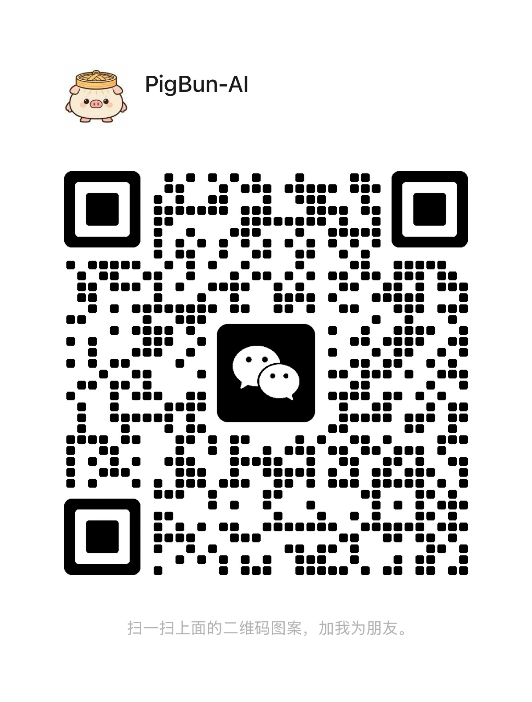

<p align="center">
  
</p>

# PigBun Partner

[Website](https://pigbunai.com) · [中文文档](./README.zh-CN.md)

## A local AI partner for work you want to entrust, not babysit.

Most AI tools wait for your next instruction.

PigBun is built for a different relationship: you explain what you want to move forward, your AI partner turns it into an ongoing workstream, and the system keeps carrying it until it needs your judgment, permission, or real-world access.

The promise is not "one more chat box." The promise is:

> You should not have to sit in front of the computer for every step.
> You set the direction. PigBun helps keep the work moving.

## Product Philosophy

Today's AI assistants often feel like still water. They only ripple when you touch them. If you are not sitting in front of the computer, nothing really moves.

PigBun wants that still water to become a river.

You set the direction. Your AI partner understands the goal, turns it into workstreams, and keeps the current moving. As the work gathers context, tools, decisions, feedback, and history, the river should become wider and deeper instead of drying up after one conversation.

That is the product philosophy behind PigBun: not a smarter box waiting for prompts, but a long-running partner system that can carry entrusted work over time.

This repository is PigBun's public home for early users:

- Installation notes
- Bug reports
- Product feedback
- Roadmap and release notes
- Community discussion

PigBun's core runtime is not open source yet. This repository is the public front door, not the full source code repository.

## How PigBun Works

The main interaction is simple:

1. You talk to your AI partner.
2. When a goal is clear enough, the partner takes it in.
3. PigBun creates a workstream for that goal.
4. The workstream keeps context, uses local tools, and continues separately from the chat.
5. When a decision, account, file, password, or approval is needed, PigBun calls you back.

That is the core difference: PigBun is designed around entrustment, not around one prompt and one answer.

## What You Can Use It For Today

PigBun is still in alpha, but it is already useful for real work:

- Turn a product idea into an ongoing workstream.
- Let a partner split work into research, product, development, deployment, and follow-up.
- Keep project context across conversations instead of restarting every time.
- Use local execution tools such as Claude Code and Codex.
- Review progress, blockers, tool activity, and decisions in the browser workbench.

PigBun is especially relevant if you are an independent builder, founder, operator, or product-minded developer who wants help carrying a project over time.

## Install

PigBun currently runs locally and opens a browser workbench.

```bash
curl -fsSL https://pigbunai.com/install.sh | bash
```

After installation, start PigBun with:

```bash
pigbun
```

The installer will check the local environment, download the latest alpha runtime, install the `pigbun` command, and open PigBun locally.

## The Model Behind PigBun Matters

PigBun is not only a model. It adds a coordination layer around the model: workstreams, memory, tool context, activity history, recovery paths, and a browser workbench. In technical discussions, this is often called a harness.

This layer helps PigBun keep work visible, organized, and recoverable. But it does not magically turn every model into a reliable partner. The model still has to understand goals, decide when to split work, use tools correctly, and recover from mistakes.

For serious early use, we strongly recommend running PigBun with a strong base model.

Recommended base models for early use:

- Claude Sonnet / Claude Opus
- GPT-5.4 / GPT-5.5
- Kimi 2.6

Kimi CLI support is planned for a future PigBun connection path.

## Current Status

PigBun is in alpha.

It can be used today, but it is not a polished public release yet.

Current focus:

- Make installation and updates boring and reliable.
- Make workstream behavior stable across real user machines.
- Remove technical language from normal product screens.
- Improve Chinese, English, and Russian wording.
- Keep Claude Code and Codex behavior predictable.

If you hit a problem, please open an issue with logs and steps to reproduce.

## Useful Links

- [Roadmap](./ROADMAP.md)
- [Known issues](./KNOWN_ISSUES.md)
- [Feedback guide](./FEEDBACK.md)
- [Changelog](./CHANGELOG.md)
- [FAQ](./FAQ.md)
- [Security and privacy notes](./SECURITY.md)

## Feedback

Use GitHub Issues when something is broken:

- Installation failed.
- PigBun cannot start.
- Chat or workstream behavior is broken.
- Update checks do not find the latest version.
- UI text is confusing or untranslated.

Use GitHub Discussions for product ideas, usage questions, workflow examples, and longer feedback.

When sharing logs, remove secrets, tokens, passwords, customer data, and private repository URLs.

## Contact

For public product discussion, use GitHub Issues and Discussions first.

For WeChat, scan the PigBun AI QR code:



For Telegram, scan the PigBun AI community group QR code:


## Not Open Source Yet

PigBun's core runtime is currently private while the product is stabilizing.

The short-term priority is reliability for early users. Public documentation, issue tracking, roadmap, and release notes will stay here.
